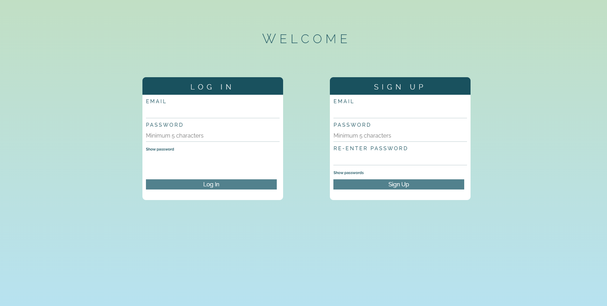

# Vue Bullet Journal

This application is created to mimic the collections section and habit tracker of the Bullet Journal System.

[Live Link](https://vue-bullet-journal-vkwho.herokuapp.com/)

Feel free to test with an existing account:  

-  Login: example@email.com
-  Password: example

View more images in **screenshots** folder:

A guide to the Bullet Journal System:  
https://www.tinyrayofsunshine.com/blog/bullet-journal-guide

---

### The purpose of this project is to learn and gain practice with:

-  Vue.js framework
-  How to incorporate components and states
-  State management (specifically Vuex)
-  Building a RESTful API
-  Authentication
-  Data storage (NoSQL database)
-  **Putting it all together**

---

### Built with:

-  Vue.js and Vuex
-  Node.js and Express.js
-  MongoDB
-  HTML, CSS, JavaScript

---

### SVG art:

-  Adobe Illustrator
